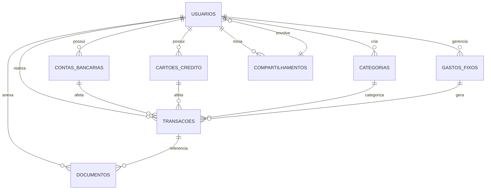

# Modelo de Banco de Dados (MySQL)

## 1. Diagrama de Entidade-Relacionamento (DER) - Conceitual

## 2. Detalhamento das Tabelas

### `USUARIOS`
- `id` (INT, PK, Auto-incremento)
- `nome` (VARCHAR(255), NOT NULL)
- `email` (VARCHAR(255), NOT NULL, UNIQUE)
- `senha_hash` (VARCHAR(255), NOT NULL) - Armazena a senha criptografada
- `data_cadastro` (DATETIME, NOT NULL, DEFAULT CURRENT_TIMESTAMP)
- `ultimo_login` (DATETIME)

### `CONTAS_BANCARIAS`
- `id` (INT, PK, Auto-incremento)
- `usuario_id` (INT, FK para USUARIOS.id, NOT NULL)
- `nome_banco` (VARCHAR(255), NOT NULL)
- `tipo_conta` (ENUM('Corrente', 'Poupança', 'Investimento'), NOT NULL)
- `saldo_inicial` (DECIMAL(10, 2), NOT NULL)
- `saldo_atual` (DECIMAL(10, 2), NOT NULL)
- `data_criacao` (DATETIME, NOT NULL, DEFAULT CURRENT_TIMESTAMP)

### `CARTOES_CREDITO`
- `id` (INT, PK, Auto-incremento)
- `usuario_id` (INT, FK para USUARIOS.id, NOT NULL)
- `nome_cartao` (VARCHAR(255), NOT NULL)
- `bandeira` (VARCHAR(255))
- `limite` (DECIMAL(10, 2), NOT NULL)
- `dia_fechamento_fatura` (INT, NOT NULL)
- `dia_vencimento_fatura` (INT, NOT NULL)
- `data_criacao` (DATETIME, NOT NULL, DEFAULT CURRENT_TIMESTAMP)

### `CATEGORIAS`
- `id` (INT, PK, Auto-incremento)
- `usuario_id` (INT, FK para USUARIOS.id, NULL) - Permite categorias globais ou personalizadas por usuário
- `nome` (VARCHAR(255), NOT NULL)
- `tipo` (ENUM('Receita', 'Despesa'), NOT NULL)
- `icone` (VARCHAR(255)) - Caminho para um ícone ou nome de ícone

### `TRANSACOES`
- `id` (INT, PK, Auto-incremento)
- `usuario_id` (INT, FK para USUARIOS.id, NOT NULL)
- `categoria_id` (INT, FK para CATEGORIAS.id, NOT NULL)
- `conta_bancaria_id` (INT, FK para CONTAS_BANCARIAS.id, NULL)
- `cartao_credito_id` (INT, FK para CARTOES_CREDITO.id, NULL)
- `tipo` (ENUM('Receita', 'Despesa'), NOT NULL)
- `valor` (DECIMAL(10, 2), NOT NULL)
- `descricao` (TEXT)
- `data_transacao` (DATETIME, NOT NULL)
- `data_criacao` (DATETIME, NOT NULL, DEFAULT CURRENT_TIMESTAMP)
- `eh_gasto_fixo` (BOOLEAN, DEFAULT FALSE)
- `gasto_fixo_id` (INT, FK para GASTOS_FIXOS.id, NULL) - Se for um gasto fixo gerado

### `GASTOS_FIXOS`
- `id` (INT, PK, Auto-incremento)
- `usuario_id` (INT, FK para USUARIOS.id, NOT NULL)
- `categoria_id` (INT, FK para CATEGORIAS.id, NOT NULL)
- `descricao` (VARCHAR(255), NOT NULL)
- `valor` (DECIMAL(10, 2), NOT NULL)
- `dia_vencimento` (INT, NOT NULL) - Dia do mês para vencimento
- `data_inicio` (DATE, NOT NULL)
- `data_fim` (DATE) - Opcional, para gastos com fim definido
- `status` (ENUM('Ativo', 'Inativo'), NOT NULL, DEFAULT 'Ativo')
- `lembrete_ativado` (BOOLEAN, DEFAULT TRUE)

### `DOCUMENTOS`
- `id` (INT, PK, Auto-incremento)
- `usuario_id` (INT, FK para USUARIOS.id, NOT NULL)
- `transacao_id` (INT, FK para TRANSACOES.id, NULL) - Opcional, se o documento estiver ligado a uma transação
- `nome_arquivo` (VARCHAR(255), NOT NULL)
- `caminho_arquivo` (VARCHAR(255), NOT NULL) - Caminho no sistema de arquivos/storage
- `tipo_documento` (ENUM('Comprovante', 'Extrato', 'Contracheque', 'Outro'), NOT NULL)
- `data_upload` (DATETIME, NOT NULL, DEFAULT CURRENT_TIMESTAMP)

### `COMPARTILHAMENTOS`
- `id` (INT, PK, Auto-incremento)
- `usuario_principal_id` (INT, FK para USUARIOS.id, NOT NULL)
- `usuario_compartilhado_id` (INT, FK para USUARIOS.id, NOT NULL)
- `data_inicio` (DATETIME, NOT NULL, DEFAULT CURRENT_TIMESTAMP)
- `data_fim` (DATETIME)
- `status` (ENUM('Ativo', 'Inativo', 'Pendente'), NOT NULL, DEFAULT 'Pendente')
- `permissoes` (JSON) - Ex: {'ver_gastos': true, 'adicionar_gastos': false}

### `METAS_FINANCEIRAS` (Ideia Complementar)
- `id` (INT, PK, Auto-incremento)
- `usuario_id` (INT, FK para USUARIOS.id, NOT NULL)
- `nome_meta` (VARCHAR(255), NOT NULL)
- `valor_alvo` (DECIMAL(10, 2), NOT NULL)
- `valor_atual` (DECIMAL(10, 2), NOT NULL, DEFAULT 0.00)
- `data_inicio` (DATE, NOT NULL)
- `data_alvo` (DATE)
- `status` (ENUM('Em Progresso', 'Concluída', 'Cancelada'), NOT NULL, DEFAULT 'Em Progresso')

### `ORCAMENTOS` (Ideia Complementar)
- `id` (INT, PK, Auto-incremento)
- `usuario_id` (INT, FK para USUARIOS.id, NOT NULL)
- `categoria_id` (INT, FK para CATEGORIAS.id, NOT NULL)
- `mes_ano` (DATE, NOT NULL) - Ex: 'YYYY-MM-01'
- `valor_orcado` (DECIMAL(10, 2), NOT NULL)
- `valor_gasto` (DECIMAL(10, 2), NOT NULL, DEFAULT 0.00)

## 3. Relacionamentos
- `USUARIOS` 1:N `CONTAS_BANCARIAS` (Um usuário pode ter várias contas bancárias)
- `USUARIOS` 1:N `CARTOES_CREDITO` (Um usuário pode ter vários cartões de crédito)
- `USUARIOS` 1:N `CATEGORIAS` (Um usuário pode criar várias categorias personalizadas)
- `USUARIOS` 1:N `TRANSACOES` (Um usuário realiza várias transações)
- `USUARIOS` 1:N `GASTOS_FIXOS` (Um usuário gerencia vários gastos fixos)
- `USUARIOS` 1:N `DOCUMENTOS` (Um usuário anexa vários documentos)
- `USUARIOS` N:M `COMPARTILHAMENTOS` (Um usuário pode compartilhar com vários, e ser compartilhado por vários)
- `CONTAS_BANCARIAS` 1:N `TRANSACOES` (Uma conta bancária pode ter várias transações)
- `CARTOES_CREDITO` 1:N `TRANSACOES` (Um cartão de crédito pode ter várias transações)
- `CATEGORIAS` 1:N `TRANSACOES` (Uma categoria pode ter várias transações)
- `GASTOS_FIXOS` 1:N `TRANSACOES` (Um gasto fixo pode gerar várias transações)
- `TRANSACOES` 1:N `DOCUMENTOS` (Uma transação pode ter vários documentos anexados)
- `USUARIOS` 1:N `METAS_FINANCEIRAS` (Um usuário pode ter várias metas financeiras)
- `USUARIOS` 1:N `ORCAMENTOS` (Um usuário pode ter vários orçamentos)
- `CATEGORIAS` 1:N `ORCAMENTOS` (Uma categoria pode ter vários orçamentos)

## 4. Índices
- Índices em `email` na tabela `USUARIOS` para buscas rápidas.
- Índices em `usuario_id` em todas as tabelas relacionadas para otimizar joins.
- Índices em `data_transacao` na tabela `TRANSACOES` para consultas por período.

## 5. Considerações de Segurança no DB
- Uso de senhas criptografadas (`senha_hash`).
- Evitar armazenar dados sensíveis não criptografados.
- Implementar permissões de usuário no banco de dados para acesso restrito.

